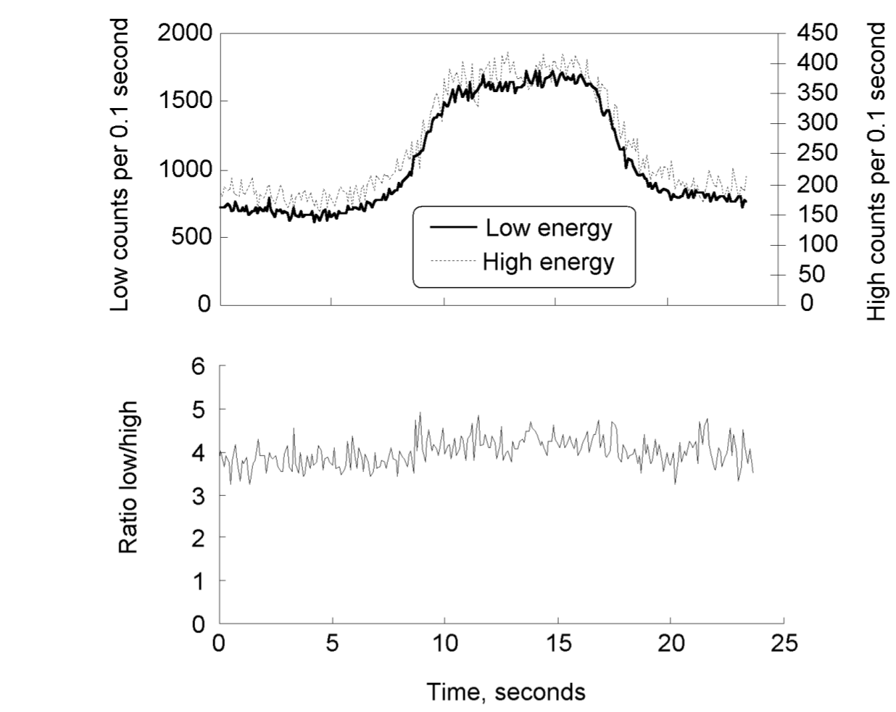



Cite : @Ely2008TheUse

::: {.callout-note}
#### 참고사항

*이 논문은 radioisotope identification 자체가 아니라 norm 의한 nuisance signal 에 의해 알림이 울리는 빈도를 줄이는 방법에 대한 논문임.*

:::

 

## 초록 번역

플라스틱 섬광체 물질은 다른 검출 물질에 비해 상대적으로 높은 민감도와 비용 효율성 때문에 많은 응용 분야에서 감마선 검출에 자주 사용됩니다. <u>그러나 지배적인 컴프톤 산란 상호작용 메커니즘으로 인해 플라스틱 섬광 스펙트럼에서 전체 에너지 피크가 관찰되지 않으며 동위원소 식별은 불가능합니다.</u> 일반적으로 플라스틱 섬광체 검출기는 오직 총계수 검출기입니다. 차량 스크리닝을 위한 방사선 포털 모니터와 같은 일부 안전장치 및 보안 애플리케이션에서는 자연 발생 방사성 물질(NORM)이 종종 방사선 경보를 발생시켜 innocent signal 이나 nuisance signal$^1$ 를 발생시킵니다. [$^1$ nuisance signal은 ‘방사선 검출 관점에서는 진짜 신호지만, 보안·감시·계측 목적에서는 쓸모없는 신호’이며,RPM 알고리즘 발전의 가장 큰 동기이다.]{.aside}  플라스틱 섬광체 물질에서 얻을 수 있는 제한된 에너지 정보는 NORM을 대상 재료와 구별하고 불편 경보율을 감소시키는 데 활용될 수 있습니다. 플라스틱 스인틸레이터 재료의 에너지 정보 활용에 대한 개요가 제시될 것이며, 탐지 능력과 보호 장치 및 보안 적용에 대한 잠재적 한계에 중점을 둘 것입니다.

 

## 연구 목적

플라스틱 섬광체(PVT)는 RPM(방사선 포털 모니터)에서 가장 널리 사용되는 감마 검출기이다. 그러나 낮은 $Z$ 값과 컴프턴 산란이 지배적이기 때문에 **photopeak이 존재하지 않으며** **동위원소 식별이 불가능**하다. 이 논문은 **제한된 에너지 정보를 어떻게 활용하면 NORM(자연방사성물질)로 인한 nuisance alarm을 줄일 수 있는가**를 분석한다.

 

## 플라스틱 섬광체의 감마 상호작용 특성  

- **컴프턴 산란이 지배적** → 연속적인 컴프턴 분포만 관측됨  
- **Photoelectric absorption**은 매우 저에너지(<50 keV)에서만 의미 있음  
- **Full-energy peak이 형성되지 않는 이유**  
  1. 낮은 $Z$ → 대부분 컴프턴  
  2. 긴 mean free path → multiple scattering 부족  
  3. 광수 통계가 낮아 에너지 분해능이 매우 낮음  

이로 인해 PVT 기반 스펙트럼은 **에너지 구분이 매우 제한적**이다.

 

## 에너지 윈도잉(Energy Windowing) 기법  

PVT에서 가능한 최소한의 스펙트럼 정보를 활용하여 **저에너지/고에너지 윈도 비율(Ratio)을 사용**하는 방법.

### 단순 Gross Count의 한계  

배경 대비 총계수 증가만 비교하면 비료(대표적 NORM) 와 플루토늄이 **동일한 크기의 증가**를 보여 구분할 수 없음.

### Ratio 기반 판별  

저에너지 윈도 / 고에너지 윈도 비율을 사용하면:

- 비료(NORM): 배경과 비슷한 비율  

- 플루토늄(SNM): 스펙트럼 형태가 달라 **비율이 유의하게 증가**  

따라서 Ratio가 **NORM nuisance alarm을 크게 줄이는 핵심 기법**임.

 

## 실차량(fertilizer truck) 실험 결과  

{width=400}

- 차량 통과 시 Low/High window 모두 증가  
- 그러나 **Low/High 비율은 배경과 거의 동일** → 비료 적재 차량은 **NORM으로 정확히 분류 가능**

 

## 대규모 차량 데이터 기반 알고리즘 평가  

수천 대의 실제 RPM 차량 데이터에 **57Co 가상 신호를 주입(injection)**하여 Gross counting vs Ratio vs 고급 알고리즘을 비교.

결과:

- Gross count 알고리즘  
  - 높은 sensitivity  
  - 그러나 **NORM alarm(오경보) 비율 매우 높음**
- Ratio 알고리즘  
  - sensitivity 유지  
  - **NORM alarm 대폭 감소**
- 고급 알고리즘(PCA, Fisher discriminant, Neural network 등)  
  - Ratio보다 더 나은 가능성 존재  

 

## 한계점  

- 의료 방사성핵종(예: Tc-99m)은 SNM과 PVT 스펙트럼 형태가 유사 → 구분 어려움  
- PMT, 전자회로는 환경 변화에 민감  
- pedestrian / 차량 검사 중 medical isotope 비중이 높으면 Ratio 방식 효과 떨어짐  

 

## 결론

- PVT의 제한적 에너지 분해능에도 불구하고, **에너지 윈도 비율(Ratio) 분석만으로 대부분의 NORM을 효과적으로 제거할 수 있음**  
- SNM 탐지 sensitivity는 유지하면서 nuisance alarm 비율을 크게 줄임  
- 추가적인 PCA, Fisher-LDA, Neural Network 기반 다변량 알고리즘이 유망  
- 그러나 동위원소 식별은 NaI(Tl) 같은 스펙트로스코픽 검출기에 비해 제한적임  
- 넓은 설치 규모가 필요한 RPM에서는 **비용·신뢰성을 고려할 때 여전히 PVT가 실용적 선택**

 