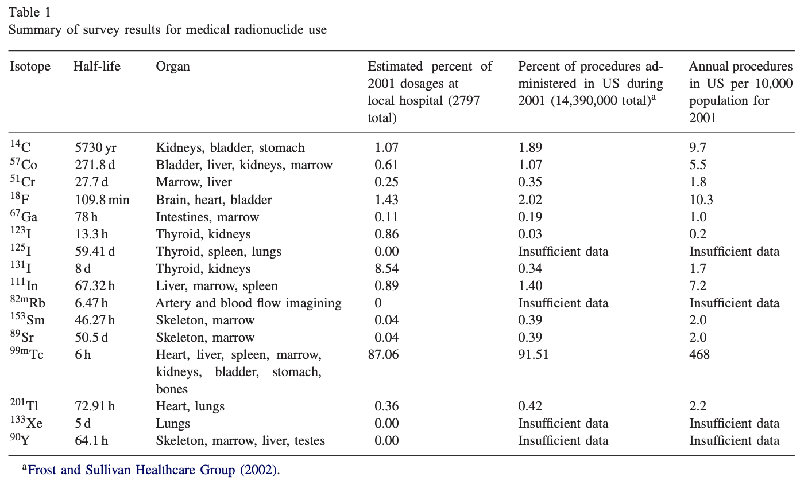
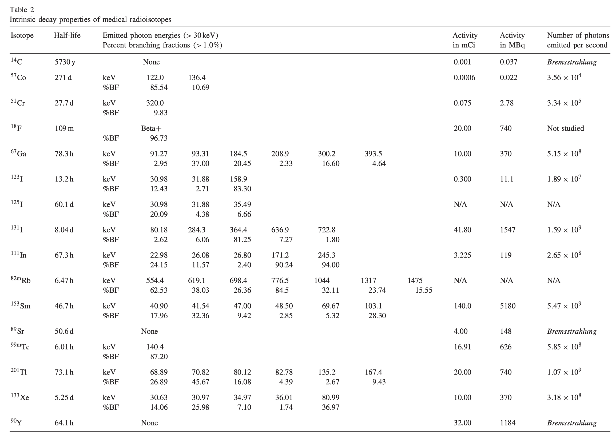



Cite : @Kouzes2006Response

## 연구 목적  
이 논문은 **방사선 포털 모니터(RPM)**가 **의료 방사성핵종(radiopharmaceuticals)** 에 어떻게 반응하는지 평가하고, 이들이 **국경 검문소에서 발생시키는 nuisance alarm(오경보)** 의 규모와 영향력을 정량적으로 분석한다.

핵심 목표:

1. 미국 의료 시스템에서 사용되는 의료 핵종의 **종류, 사용량, 투여량 조사**  
2. 이 핵종들의 감마 방출 특성을 이용해 **MCNP 기반 RPM 응답 시뮬레이션 수행**  
3. 그 결과를 기반으로 **국경에서 발생하는 의료 핵종 오경보 비율을 추정**

 

## 의료 핵종 사용 현황 

{#tbl-Kouzes2006Response_Table_1 width=600}

- 2001년 미국 내 의료 핵의학 절차: **1,439만 건**  
- 이 중 **약 92%가 진단용**, 8%가 치료용  
- 사용되는 전체 방사성의약품은 45개 이상이지만, 실제 핵종은 단 **17종**  
- 이 중 RPM이 탐지할 가능성이 높은 방사성 핵종은 **9종**

**가장 중요한 핵종: ** **99mTc**

- 전체 진단 절차의 **90%** 이상을 차지  
- 반감기 6시간, 140 keV 감마 → RPM에서 매우 잘 검출됨

그 외 빈번한 핵종:  

- **131I, 67Ga, 61Cr, 201Tl, 111In, 123I, 153Sm**  
- 대부분 30–250 keV 감마를 방출 → RPM의 Low-energy 영역에서 강한 반응

---

## 3. 핵종별 감마 붕괴 특성 

{#tbl-Kouzes2006Response_Table_2 width=800}

Table 2는 다음 정보를 포함:
- 반감기  
- 주요 감마 에너지  
- branching fraction(%BF)  
- 평균 투여량(mCi)  
- 초당 방출 감마 개수

**핵심 관찰**  
- 대부분의 의료핵종은 **250 keV 이하 감마**가 지배적 → RPM의 Low-energy 윈도에서 강한 카운트  
- 67Ga, 51Cr, 131I 등 일부는 **250 keV 이상 감마도 방출** → High-energy 윈도에서도 신호 발생  
- 99mTc의 경우 6시간 반감기이지만 투여량이 매우 크기 때문에 오경보 원인 1위

 

## RPM 모델링(MCNP) 구성 (p.6–9, Fig. 4–6)  

- 실제 국경에서 사용하는 **트럭용 포털**을 기반으로 모델 구축  
- 1개 차선은 **4개의 플라스틱 패널(PVT) 검출기**, 인접 차선의 검출기도 포함해 **총 8개 패널**의 response 계산  
- 의학 핵종은 사람 몸에서 나오는 것으로 가정 → **높이 1.5 m, 한쪽 패널에 가까운 위치**로 모델링  
- 두 차선 간 간섭(cross-talk)도 평가

 

## 시뮬레이션 결과

### Lane-1 (핵종이 있는 차선) 응답 (p.10–11, Fig. 7)

99mTc 예시:

- 차량이 가까워질수록 bottom/passenger 패널에서 카운트 급증  
- 검출기 배치에 따른 비대칭성이 뚜렷함  
- Low-energy(5–250 keV)에서 매우 높은 카운트 생성

### Lane-2(인접 차선) cross-talk 응답 (p.10–11, Fig. 8)

- Lane-2에서도 상당한 gamma가 검출됨  
- passenger-side가 driver-side보다 10배 이상 많이 측정  
- High-energy 감마를 방출하는 ⁶⁷Ga, ¹³¹I, ⁵¹Cr에서 cross-talk가 특히 큼  

### Cross-talk 비율 (p.11)

- Lane-2 / Lane-1 비율은 **11–18% 수준**  
- 즉, 의료핵종을 가진 승객 1명 → **두 차선 모두 오경보 발생 가능**

 

## 핵종별 오경보 지속 시간 (p.12, Fig. 9)

핵종별 RPM alarm 지속 가능 기간:

| 핵종 | 오경보 가능 기간 |
|------|------------------|
| **99mTc** | **3.4일** |
| ¹²³I | ~6일 |
| ²⁰¹Tl | ~5일 |
| ⁶⁷Ga | ~8일 |
| ⁵¹Cr | ~10일 |
| **¹³¹I** | **115일 이상** (치료용) |
| ¹¹¹In | ~9일 |
| ¹⁵³Sm | ~10일 |

특히 ¹³¹I 등 치료용 핵종은 몇 주 ~ 수개월 동안 RPM에서 알람 가능.

 

## 오경보 발생 확률 (p.12–13)

미국 기준:

- 99mTc 진단 건수: **연 1,316만 건**
- 1명당 평균 3일 동안 RPM에서 검출 가능

따라서 오경보 확률:

> **1/2581명 ≈ 차량 기준 1/1300대**

이 값은 실제 국경 데이터(1/500~1/2000 차량)와 일치.

 

## 8. 결론 (p.13–14)  

- 의료 방사성핵종은 **RPM nuisance alarm의 가장 큰 원인**  
- 대부분의 핵종은 **Lane-1뿐 아니라 Lane-2에서도 cross-talk alarm을 일으킴**  
- 99mTc는 가장 빈번하며, 131I는 가장 오래 지속  
- 의료 핵종 알람은 **RPM 운영 부담 증가**, 필수적인 **2차 검사 증가**, 여러 차선의 **동시 경보(cross-lane alarm)**까지 유발  
- 미래 과제: 의료 핵종을 자동 분류할 수 있는 고급 알고리즘 필요

 

## 핵심 요약 문장  

**“의료 방사성핵종은 미국 국경 RPM에서 발생하는 오경보의 주요 원인이며, 하루 평균 약 1/1300 차량이 의료핵종으로 인해 알람을 발생시킨다.”**

