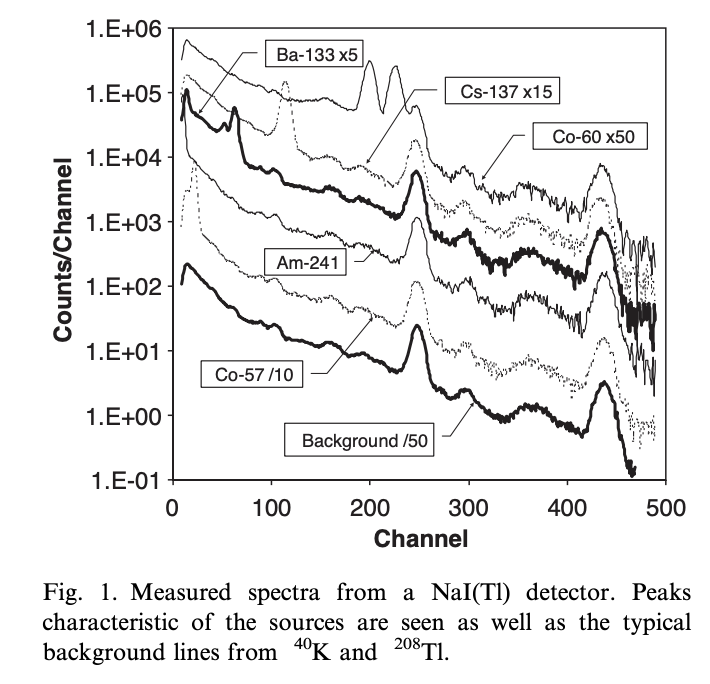
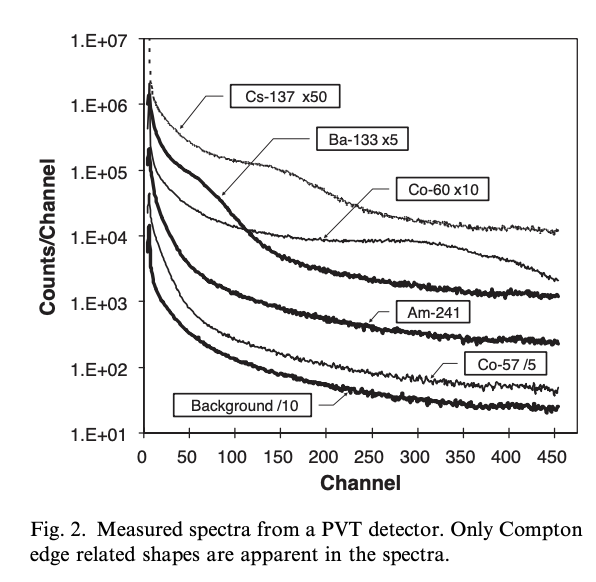



Cite : @Sicilliano2005Comparision

## 연구 목적

본 논문은 방사선 포털 모니터(RPM)에서 널리 쓰이는 **PVT(Plastic Scintillator)** 와 **NaI(Tl)** 검출기를 비교하여, 국경 검문소에서 핵물질 탐지 성능을 평가하는 데 목적이 있다.

## 두 검출기의 특성 비교

|  NaI(Tl) | PVT(or plastic) |
|:------|:--------|
| - 고밀도, 고원자번호 →     **높은 intrinsic efficiency** **뛰어난 에너지 분해능**, photopeak 명확 | - 저밀도 → intrinsic 효율은 낮지만 **대형 제작 가능  → absolute efficiency는 NaI보다 커질 수 있음**|
| - 동위원소 식별 가능 | - 에너지 정보는 제한적(Compton continuum) |
|- 고가, 온도·충격에 취약 | - 저가, 내환경성 우수

 

## 실험 스펙트럼 비교
::: {layout-ncol=2}

:::

- NaI(Tl): 명확한 photopeak  
- PVT: 저에너지에 몰린 Compton 분포  
- 일부 에너지 창(Window)을 활용한 분석 가능

 

## MCNP 시뮬레이션 결과

- NaI(Tl) intrinsic efficiency: **200 keV 근처에서 90%**
- PVT intrinsic efficiency: **100 keV 근처 40–50%**
- 절대 효율은 PVT가 더 높음(Fig. 5)
- 최적 두께:
  - NaI(Tl): 약 **1 cm**
  - PVT: **10–20 cm**

 

## Cargo 감쇠 분석

- 100 keV 이하: **감쇠 105 배**
- 1.5 MeV 이상: **감쇠 10 배**
- PVT: 원래 스펙트럼이 featureless → cargo 영향 상대적으로 덜 치명적
- Bare / Cargo 모두 PVT:NaI 비는 **5:1**

 

## 결론 요약

| 항목 | PVT | NaI(Tl) |
|------|-----|----------|
| 비용 | ⭐ 매우 낮음 | 높음 |
| 크기 확장성 | ⭐ 대형 제작 용이 | 제한적 |
| 분해능 | 낮음 | ⭐ 매우 높음 |
| 동위원소 식별 | 제한적 | ⭐ 가능 |
| 내환경성 | ⭐ 강함 | 취약 |
| 1차 검사 | ⭐ 적합 | 비경제적 |
| 2차 검사 | 일부 가능 | ⭐ 최적 |

**요약:**

1차 검문에는 **PVT**, 정밀 식별이 필요한 2차 검문에는 **NaI(Tl)** 이 적합하다.

 

## 활용도

- 논문 Introduction의 리뷰 자료  
- RPM detector 비교 근거  
- Background compensation, spectral analysis 논문 인용 근거로 활용 가능  

 

